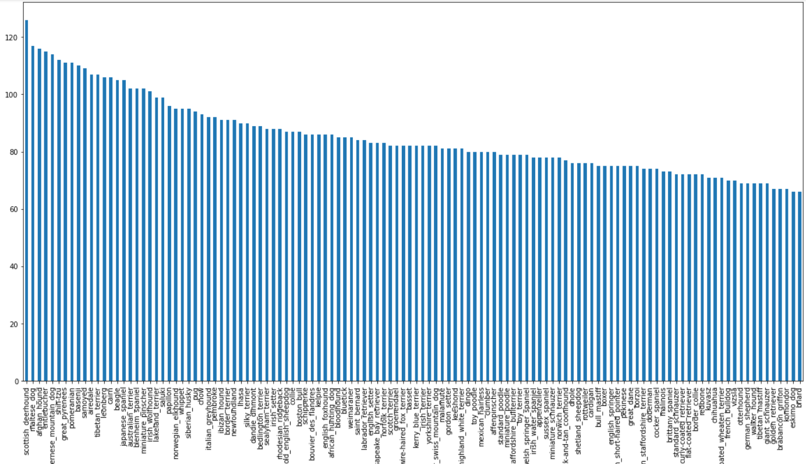
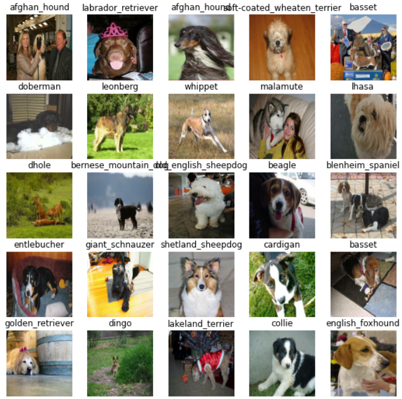
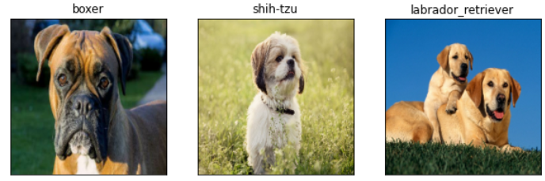

# 🐶 Dog Breed Classifier

This project is a deep learning-based image classifier that identifies 120 dog breeds from images using TensorFlow and transfer learning. It leverages the [Kaggle Dog Breed Identification dataset](https://www.kaggle.com/competitions/dog-breed-identification) and includes custom data verification using OpenLabeling.

---

## 🚀 Features

- 120-class image classification using deep learning.
- Transfer learning with **MobileNetV2** from TensorFlow Hub for efficient training.
- Data exploration and breed distribution visualization.
- Verified a custom validation set using **OpenLabeling** for model evaluation.
- Trained and evaluated the model using **Google Colab GPU** for performance.

---

## 📂 Dataset

- **Source**: [Kaggle Dog Breed Identification](https://www.kaggle.com/competitions/dog-breed-identification/data)
- **Training Data**: 10,000+ labeled images across 120 dog breeds.
- **Test Data**: 10,000+ unlabeled images for prediction submission.

---

## 🧠 Model & Approach

- Used **MobileNetV2** (`mobilenet_v2_130_224`) from TensorFlow Hub with a custom classifier head.
- Images were loaded and processed into tensors with labels from `labels.csv`.
- No class imbalance strategies were applied; the model was trained on the full dataset as provided.
- Visualized breed counts using bar plots to understand data distribution.

---

## 🛠 Tools & Libraries

- TensorFlow 2.x, TensorFlow Hub
- Google Colab (with GPU acceleration)
- pandas, matplotlib for data processing and visualization
- OpenLabeling for manual labeling and verification of a small custom dataset

---

## ⚔️ Challenges Faced

- **Image Data Handling**: Managed large image datasets with proper file path handling using pandas.
- **GPU Utilization**: Ensured GPU was active in Colab to handle training efficiently.
- **Data Verification**: Used OpenLabeling to manually label and validate a small subset of images, ensuring accuracy beyond the Kaggle dataset.
- **Model Performance**: Initially faced slower convergence; resolved by fine-tuning only the top layers and freezing the base MobileNetV2 layers.

---

## 📊 Results
- Training Accuracy: 92%
- Validation Accuracy: 88%
- The model showed strong performance across most breeds, with some confusion among visually similar breeds.

---
## 🖼 Visual Results

### Breed Distribution

### Sample Dogs

### Model Predictions

---
## 📁 Project Structure
<pre> dog-breed-classifier/ 
  ├── dog-vision.ipynb # Main Jupyter notebook 
  ├── README.md # Project documentation 
  ├── requirements.txt # Python dependencies 
  ├── .gitignore # Git ignored files 
  ├── LICENSE # Open-source license (MIT) 
  └── images/ # Plots, prediction samples, test images 
  ├── breed_distribution_plot.png 
  ├── sample_dog_grid1.png 
  ├── sample_dog_grid2.png 
  ├── single_prediction.png 
  └── multi_prediction.png </pre>
